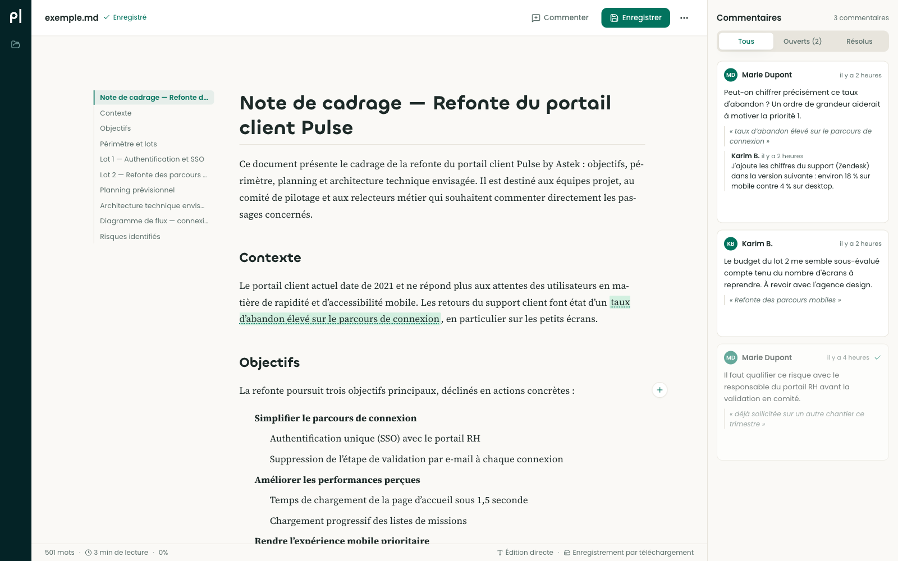
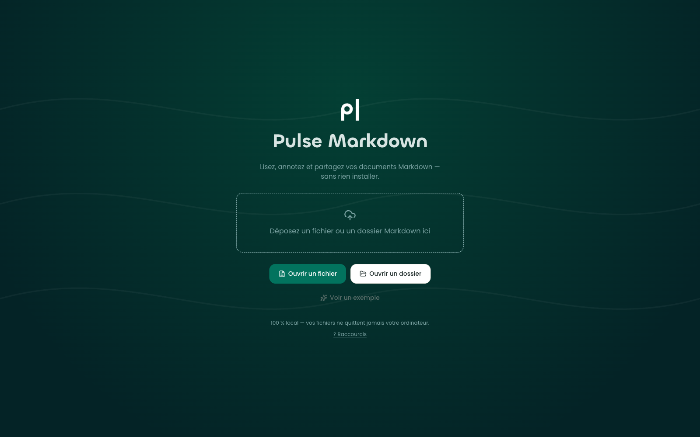
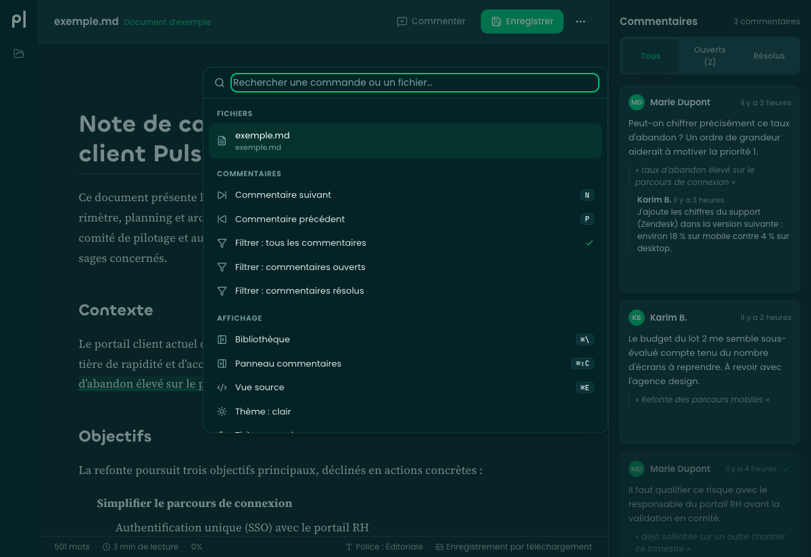

# Pulse Markdown

**Lisez, annotez et partagez vos documents Markdown en 100 % local, sans rien installer.**

Pulse Markdown est une salle de lecture pour relire des documents comme on annote une épreuve papier au feutre vert, dans un atelier calme. L'application est livrée sous forme d'un seul fichier HTML autonome : double-clic, l'app s'ouvre dans le navigateur, sans internet, sans serveur, sans installation.

---

## Démarrage en 10 secondes

1. Double-clic sur `pulse-markdown.html`
2. L'app s'ouvre dans votre navigateur
3. Déposez un fichier `.md` ou un dossier entier dans la zone de dépôt
4. Lisez, annotez, enregistrez — votre navigateur se charge du reste

Vos fichiers ne quittent jamais votre ordinateur.

---

## Aperçu

| Lecture annotée | Thème sombre |
|---|---|
|  |  |

| Accueil | Palette de commandes (⌘K) |
|---|---|
|  |  |

D'autres captures dans [`docs/captures/`](docs/captures/) : vue source, diagrammes Mermaid, raccourcis, mobile.

---

## Fonctionnalités principales

- **📖 Lecture soignée** : composition éditoriale exigeante, typographie de bel imprimé (serif par défaut, 17px/1.75, largeur 72 caractères). Thème clair et sombre adapté.

- **📁 Dossier entier** : ouvrez un dossier complet, explorez l'arborescence dans le panneau latéral. Compteurs de commentaires en direct, images relatives résolues automatiquement.

- **💬 Commentaires embarqués** : annotez chaque passage en sélectionnant du texte ; les commentaires vivent dans le même fichier `.md`, **invisibles** à GitHub et compatibles avec tous les outils Markdown. Vos passages restent parfaitement rendus partout.

- **🤖 IA-ready** : copier le prompt de relecture IA en un clic — votre IA lira le fichier brut, comprendra les commentaires JSON et pourra appliquer les corrections directement.

- **🌓 Thèmes clair et sombre** : interface sobre, profonde (vert nuit), papier blanc cassé chaud. Passage automatique selon les préférences système.

- **💾 Hors-ligne complet** : pas de requête réseau, pas de compte, pas de dépôt distant. Enregistrez directement (Chrome/Edge) ou téléchargez (Firefox/Safari).

---

## Raccourcis clavier

| Touche | Action |
|---|---|
| ⌘O | Ouvrir un fichier |
| ⌘⇧O | Ouvrir un dossier |
| ⌘S | Enregistrer |
| ⌘P | Imprimer |
| c | Commenter la sélection/le bloc |
| ⌘⏎ | Envoyer (composer) |
| Échap | Fermer (palette, composer, aide) |
| ⌘K | Palette de commandes |
| ⌘E | Vue source ⇄ rendu |
| ⌘\ | Bibliothèque |
| ⌘⇧C | Panneau commentaires |
| n / p | Commentaire suivant/précédent |
| ? | Aide raccourcis |

*Sur Windows/Linux, remplacez ⌘ par Ctrl.*

---

## Le format de commentaires

Chaque commentaire est un bloc JSON embarqué dans un commentaire HTML, **invisible** dans GitHub et tout rendu standard :

```markdown
Le chiffre d'affaires du T3 progresse de 12 % sur la région Nord.

<!--pulse:comment
{
  "v": 1,
  "id": "pc-x7k2m9",
  "status": "open",
  "author": "Marie Dupont",
  "createdAt": "2026-07-04T14:32:00+02:00",
  "text": "Peut-on préciser la source de ce chiffre ?",
  "anchor": {
    "quote": "progresse de 12 % sur la région Nord",
    "prefix": "d'affaires du T3 ",
    "suffix": ".",
    "heading": "Résultats commerciaux",
    "blockType": "paragraph"
  },
  "replies": []
}
-->

## Section suivante
```

**Caractéristiques :**
- Format JSON explicite : toute IA lisant le fichier brut le comprend sans documentation.
- Résilience : si le document est modifié ailleurs, l'app retrouve les commentaires par leur contenu (quote).
- Aucune perte silencieuse : si le passage visé a été modifié entre-temps, le commentaire devient « orphelin » mais reste affiché et exploitable.

Pour la spécification complète, consultez [`docs/COMMENT-SPEC.md`](docs/COMMENT-SPEC.md).

### Prompt de relecture IA (à copier-coller)

```
Ce document Markdown contient des commentaires de relecture embarqués dans des
marqueurs <!--pulse:comment … --> (JSON : author, text, status, anchor.quote =
extrait visé, replies). Traite chaque commentaire au statut "open" : applique
la correction demandée au texte visé par anchor.quote, puis passe le marqueur
correspondant à "status": "resolved" en ajoutant une reply signée de ton nom
résumant la modification. Ne supprime aucun marqueur.
```

Bouton dans l'app : **Copier le prompt IA** (menu ⋯).

---

## Navigateurs supportés

| Navigateur | Enregistrement | Note |
|---|---|---|
| **Chrome, Edge** | Direct (FS Access) | Écrivez directement dans vos fichiers. |
| **Firefox, Safari** | Téléchargement | Ouvrir + télécharger ensuite ; glissez-déposez pour remplacer. |

Pulse Markdown fonctionne sur tous les navigateurs modernes. Pour une meilleure expérience, préférez Chrome ou Edge.

---

## Développement

### Installation

```bash
npm install
```

### Scripts

```bash
# Développement local avec rechargement chaud
npm run dev

# Vérification des types
npm run typecheck

# Tests
npm run test

# Build de production (HTML autonome)
npm run build

# Build + création de pulse-markdown.html à la racine
npm run package
```

### Arborescence source

```
src/
├── main.tsx                  # Bootstrap React
├── App.tsx                   # Shell principal
├── store.ts                  # État zustand
├── types.ts                  # Contrats TypeScript
├── core/
│   ├── comments/             # Moteur de commentaires (parsing, mutations)
│   ├── markdown/             # Rendu Markdown + sanitisation
│   └── files/                # Gestion fichiers (FS Access + fallbacks)
├── components/               # Composants React
├── hooks/                    # Raccourcis, ancrage
├── styles/                   # Tokens, typographie, thèmes
└── assets/                   # Fonts embarquées, icônes, démo
```

### Stack figée

- **React 19** + TypeScript strict
- **Vite 7** + `vite-plugin-singlefile` (tout inliné en un seul HTML)
- **Tailwind CSS v4** pour l'UI applicative
- **markdown-it** + highlight.js + mermaid pour le rendu
- **zustand** pour l'état
- **DOMPurify** pour la sanitisation HTML
- Tests : **vitest** + jsdom

Aucune dépendance supplémentaire permise.

---

## Limites connues

- **Très gros documents** : l'affichage reste fluide sur des documents de plusieurs centaines de Ko ; au-delà de quelques Mo, le premier rendu peut prendre quelques secondes.
- **Mermaid** : les diagrammes complexes peuvent être lents à rendre.
- **Images** : les images relatives sont résolues quand un dossier est ouvert ; les images distantes (http) dépendent de votre connexion.
- **Firefox/Safari** : pas d'enregistrement direct dans le fichier (le navigateur télécharge une copie à enregistrer).

---

## Ressources complémentaires

- **Spécification technique** : [`docs/SPEC.md`](docs/SPEC.md)
- **Format des commentaires** : [`docs/COMMENT-SPEC.md`](docs/COMMENT-SPEC.md)
- **Design & UX** : [`docs/DESIGN-BRIEF.md`](docs/DESIGN-BRIEF.md)

---

**Pulse Markdown** — Lisez, annotez, partagez. En local. En silence.
