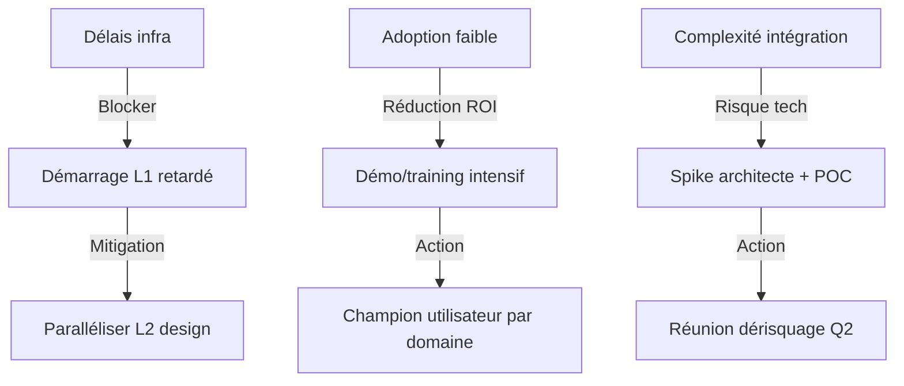

# Note de cadrage — Plateforme d'innovation collaborative Pulse

## 1. Contexte et enjeu

La cellule innovation de Pulse by Astek travaille depuis 18 mois sur la modernisation de l'outillage collaboratif interne. Les équipes constatent une fragmentation de l'information entre plusieurs outils (Slack, Confluence, GitHub, Jira) sans vue d'ensemble ni traçabilité métier des décisions.

Cette initiative vise à construire une **plateforme centrale** — un hub collaboratif combinant la veille technologique, les fiches projets, le registre des compétences, et un moteur de discussion asynchrone. Objectif : réduire les délais décisionnels de 40 % et améliorer la rétention du savoir-faire collectif.

## 2. Objectifs

- **Centraliser la connaissance métier** : un seul endroit pour les roadmaps, décisions, et archives
- **Améliorer la traçabilité** : qui a décidé quoi, quand, pourquoi — horodatage et versioning des choix
- **Faciliter l'embarquement** : un nouveau talent trouve l'historique complet d'un projet en 30 minutes
- **Animer l'innovation** : faire du radar technologique un outil vivant, débattu, partagé avec les clients
- **Mesurer l'impact** : tableau de bord des initiatives, taux d'adoption, ROI métier

## 3. Périmètre fonctionnel

| Domaine | Fonction | Priorité |
|---------|----------|----------|
| Catalogue | Registre des projets, missions, compétences internes | P0 |
| Radar | Interface du tech radar (éléments, votes, historique) | P0 |
| Relecteur | Application de lecture/annotation collaborative des docs | P1 |
| Blog | Espace de publication des insights et retours d'expérience | P1 |
| Timeline | Frise chronologique des jalons et décisions | P2 |
| Intégrations | SSO (OIDC), webhook Jira, sync calendrier | P2 |

## 4. Lots et charges

| Lot | Description | Effort | Dates prévues | Owner |
|-----|-------------|--------|---|---------|
| L1 | API backend (catalog, auth, media) | 12 sp | Q3 2026 | Infra |
| L2 | Frontend dashboard (React 19, Tailwind) | 10 sp | Q3 2026 | FrontEnd |
| L3 | Relecteur interactif (parsing Markdown, commentaires) | 6 sp | Q4 2026 | FrontEnd |
| L4 | Intégrations externes et webhooks | 5 sp | Q4 2026 | BackEnd |
| L5 | Migration données (export Legacy → DB) | 8 sp | Q4 2026 | Data |

**Charge totale estimée : 41 story points** (6 mois, équipe de 4).

## 5. Livrables et jalons

- [ ] Backlog affiné et priorisé (fin juillet)
- [ ] Prototype UI du catalog (fin août)
- [ ] API v1 en staging avec auth OIDC (fin septembre)
- [ ] Lancement beta interne — 20 utilisateurs (fin octobre)
- [ ] Retours et itération (novembre)
- [ ] Ouverture client progressive (décembre)
- [ ] Production et monitoring (janvier 2027)

## 6. Risques et mitigation

## 7. Ressources et gouvernance

**Équipe**: 1 Product Manager, 1 Architect, 2 Backend Dev, 2 Frontend Dev, 1 QA, 1 DevOps.
**Budget**: 120 k€ (salaires mutualisés + infra cloud + outils).
**Décideurs**: Steering committee Pulse (hebdo), DOPS (contrôle budgétaire).

> « L'innovation sans traçabilité n'est que du bruit. Nous bâtissons une mémoire vivante. »
> — Manifeste Pulse by Astek

## 8. Prochaines étapes

1. **Validation stakeholders** (cette semaine) : réunion avec DOPS et teams métier
2. **Affinement backlog** (semaine prochaine) : atelier 3 points avec l'équipe prod
3. **Lancement L1** (15 juillet) : kick-off infra, setup CI/CD
4. **Prototype UI** (31 août) : démo en steering

---

*Document validé par : Steering Committee Pulse — 04/07/2026*  
*Prochaine revue : 04/08/2026*
