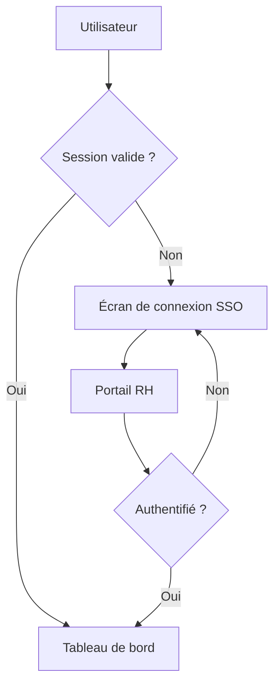

# Note de cadrage — Refonte du portail client Pulse

Ce document présente le cadrage de la refonte du portail client Pulse by
Astek : objectifs, périmètre, planning et architecture technique envisagée.
Il est destiné aux équipes projet, au comité de pilotage et aux relecteurs
métier qui souhaitent commenter directement les passages concernés.

## Contexte

Le portail client actuel date de 2021 et ne répond plus aux attentes des
utilisateurs en matière de rapidité et d'accessibilité mobile. Les retours du
support client font état d'un taux d'abandon élevé sur le parcours de
connexion, en particulier sur les petits écrans.

<!--pulse:comment
{
  "v": 1,
  "id": "pc-a1b2c3",
  "status": "open",
  "author": "Marie Dupont",
  "createdAt": "2026-07-04T11:40:00+02:00",
  "text": "Peut-on chiffrer précisément ce taux d'abandon ? Un ordre de grandeur aiderait à motiver la priorité 1.",
  "anchor": {
    "quote": "taux d’abandon élevé sur le parcours de connexion",
    "prefix": "font état d’un ",
    "suffix": ", en particulier",
    "heading": "Contexte",
    "blockType": "paragraph"
  },
  "replies": [
    { "author": "Karim B.", "createdAt": "2026-07-04T12:05:00+02:00", "text": "J'ajoute les chiffres du support (Zendesk) dans la version suivante : environ 18 % sur mobile contre 4 % sur desktop." }
  ]
}
-->

## Objectifs

La refonte poursuit trois objectifs principaux, déclinés en actions concrètes :

- **Simplifier le parcours de connexion**
  - Authentification unique (SSO) avec le portail RH
  - Suppression de l'étape de validation par e-mail à chaque connexion
- **Améliorer les performances perçues**
  - Temps de chargement de la page d'accueil sous 1,5 seconde
  - Chargement progressif des listes de missions
- **Rendre l'expérience mobile prioritaire**
  - Refonte complète des gabarits en mobile-first
  - Navigation par onglets bas d'écran sur petit format

## Périmètre et lots

Le projet est découpé en quatre lots, avec un budget indicatif par lot :

| Lot | Périmètre | Budget estimé | Statut |
|---|---|---|---|
| Lot 1 | Authentification et SSO | 45 000 € | Cadrage |
| Lot 2 | Refonte des parcours mobiles | 68 000 € | Cadrage |
| Lot 3 | Performances et cache | 32 000 € | À planifier |
| Lot 4 | Migration des données existantes | 27 000 € | À planifier |

<!--pulse:comment
{
  "v": 1,
  "id": "pc-d4e5f6",
  "status": "open",
  "author": "Karim B.",
  "createdAt": "2026-07-04T12:15:00+02:00",
  "text": "Le budget du lot 2 me semble sous-évalué compte tenu du nombre d'écrans à reprendre. À revoir avec l'agence design.",
  "anchor": {
    "quote": "Refonte des parcours mobiles",
    "prefix": "Lot 2 ",
    "suffix": " 68 000 €",
    "heading": "Périmètre et lots",
    "blockType": "table"
  },
  "replies": []
}
-->

### Lot 1 — Authentification et SSO

Mise en place d'une connexion unique adossée au portail RH existant, avec
gestion des rôles et des habilitations par mission.

### Lot 2 — Refonte des parcours mobiles

Reprise complète des gabarits d'écran pour un affichage mobile-first, y
compris les formulaires de demande de mission et le tableau de bord.

## Planning prévisionnel

- [x] Atelier de cadrage avec les parties prenantes
- [x] Rédaction de la présente note
- [ ] Validation du budget en comité de pilotage
- [ ] Lancement du lot 1 (authentification)
- [ ] Recette utilisateurs sur le lot 2

## Architecture technique envisagée

Le portail s'appuiera sur une architecture découplée : un frontend React
consommant une API REST existante, avec un cache applicatif côté client pour
réduire les allers-retours réseau.

```ts
interface PortailSession {
  userId: string;
  roles: string[];
  expiresAt: string;
}

async function refreshSession(session: PortailSession): Promise<PortailSession> {
  const response = await fetch('/api/session/refresh', { method: 'POST' });
  if (!response.ok) {
    throw new Error('Impossible de rafraîchir la session.');
  }
  return response.json();
}
```

## Diagramme de flux — connexion



> La priorité du comité de pilotage reste claire : livrer un parcours de
> connexion fiable avant toute autre amélioration visuelle.

## Risques identifiés

Le principal risque porte sur la disponibilité de l'équipe du portail RH pour
l'intégration SSO, déjà sollicitée sur un autre chantier ce trimestre[^1].

<!--pulse:comment
{
  "v": 1,
  "id": "pc-g7h8i9",
  "status": "resolved",
  "author": "Marie Dupont",
  "createdAt": "2026-07-04T10:20:00+02:00",
  "text": "Il faut qualifier ce risque avec le responsable du portail RH avant la validation en comité.",
  "anchor": {
    "quote": "déjà sollicitée sur un autre chantier ce trimestre",
    "prefix": "l’intégration SSO, ",
    "suffix": ".",
    "heading": "Risques identifiés",
    "blockType": "paragraph"
  },
  "replies": [],
  "resolvedBy": "Marie Dupont",
  "resolvedAt": "2026-07-04T12:30:00+02:00"
}
-->

Pour plus de détails sur le référentiel technique commun, voir la
[documentation Pulse by Astek](https://astekgroup.github.io/pulse-devhub/).

[^1]: Confirmé lors du comité du 2 juillet 2026 : l'équipe portail RH est
    mobilisée jusqu'à mi-septembre sur la migration de son propre socle.
